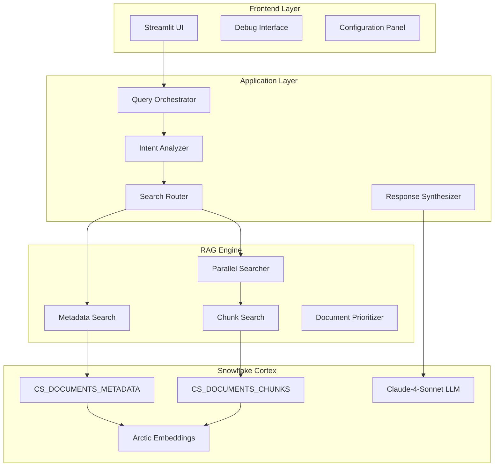
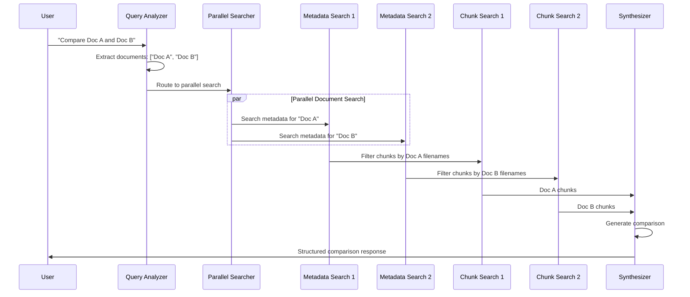
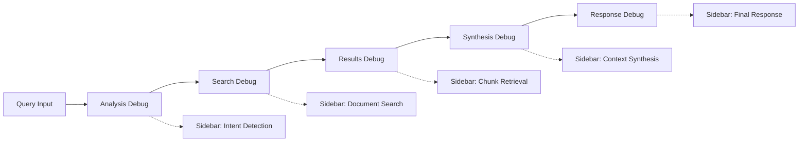

# 🏗️ Technical Architecture Documentation

## 📖 **Overview**

This document provides a deep technical dive into the Intelligent Multi-Stage RAG Chatbot architecture, implementation patterns, and design decisions.

## 🎯 **Core Architecture Principles**

### **1. Intent-Driven Routing**
The system uses LLM-powered query analysis to determine the optimal retrieval strategy, moving beyond traditional one-size-fits-all RAG approaches.

### **2. Multi-Stage Retrieval Pipeline**
A two-stage search process that first identifies relevant documents, then retrieves specific content chunks, significantly improving precision.

### **3. Parallel Processing for Comparisons**
Concurrent document searches enable sophisticated comparison queries that would be impossible with traditional RAG.

### **4. Graceful Degradation**
Multiple fallback mechanisms ensure the system remains functional even when individual components fail.

## 🔧 **System Components**



## 🧠 **Query Analysis Engine**

### **Intent Classification**

The LLM Query Planner classifies queries into four categories:

```python
QUERY_TYPES = {
    "single_document": "Standard info retrieval from one document/topic",
    "comparison": "Comparing 2+ specific documents or entities",
    "multi_document": "Questions about multiple separate topics/documents", 
    "general": "Broad questions not tied to specific documents"
}
```

### **Analysis Pipeline**

1. **Query Preprocessing**: Clean and normalize the user question
2. **Intent Detection**: Use Claude-4-Sonnet to analyze query semantics
3. **Entity Extraction**: Identify specific document names or topics
4. **Strategy Planning**: Generate optimal search queries for each entity
5. **Route Selection**: Choose appropriate workflow based on analysis

### **JSON Response Schema**

```json
{
    "query_type": "comparison|single_document|multi_document|general",
    "documents": ["document name 1", "document name 2"],
    "search_queries": ["search query 1", "search query 2"],
    "analysis_type": "comparison|synthesis|standard",
    "reasoning": "brief explanation of the analysis"
}
```

## 🔍 **Two-Stage Retrieval System**

### **Stage 1: Metadata Search (`CS_DOCUMENTS_METADATA`)**

**Purpose**: Document discovery and relevance ranking

**Data Structure**:
```sql
DOCUMENTS_RAW_PARSED_METADATA (
    FILENAME VARCHAR,           -- Document identifier
    FILE_URL VARCHAR,          -- Access URL
    PARSED_CONTENT TEXT,       -- Full document content
    CONTENT_METADATA TEXT      -- LLM-generated metadata
)
```

**Search Strategy**:
- Search column: `CONTENT_METADATA`
- Attributes: `FILENAME` (for Stage 2 filtering)
- Embedding model: `snowflake-arctic-embed-l-v2.0`
- Limit: 50 results for broad coverage

**Metadata Generation**:
Uses Claude-4-Sonnet to extract key document characteristics:
- Document type and purpose
- Key entities and topics
- Important dates and references
- Business context and relationships

### **Stage 2: Chunk Search (`CS_DOCUMENTS_CHUNKS`)**

**Purpose**: Precise content retrieval with context

**Data Structure**:
```sql
CHUNKS_CONTEXTUALIZED (
    FILENAME VARCHAR,              -- Document identifier
    FILE_URL VARCHAR,             -- Access URL  
    CONTEXTUALIZED_CHUNK TEXT     -- Metadata + chunk content
)
```

**Chunking Strategy**:
- **Chunk size**: 1800 characters (optimal for embeddings)
- **Overlap**: 300 characters (preserves context across boundaries)
- **Contextualization**: Each chunk prefixed with document metadata
- **Splitting method**: Recursive character splitting (preserves sentence boundaries)

**Search Strategy**:
- Search column: `CONTEXTUALIZED_CHUNK`
- Attributes: `FILENAME` (for precise filtering)
- Filter: `{"@or": [{"@eq": {"FILENAME": "doc1"}}, {"@eq": {"FILENAME": "doc2"}}]}`

## 🌐 **Parallel Search Architecture**

### **Comparison Query Workflow**



### **Document Prioritization Algorithm**

```python
def prioritize_filenames(document_name, filenames):
    """
    Prioritize filenames based on document name matching
    """
    prioritized = []
    other = []
    
    doc_words = document_name.lower().split()
    for filename in filenames:
        filename_lower = filename.lower()
        # Match significant words (length > 3)
        if any(word in filename_lower for word in doc_words if len(word) > 3):
            prioritized.append(filename)
        else:
            other.append(filename)
    
    return prioritized + other  # Prioritized first, then others
```

## 🤖 **LLM Integration Points**

### **1. Query Analysis LLM**

**Model**: Claude-4-Sonnet  
**Purpose**: Intent classification and query planning  
**Input**: Raw user question  
**Output**: Structured analysis with routing decisions

**Prompt Engineering**:
- Clear task definition with examples
- Structured JSON output format
- Fallback handling for edge cases
- Reasoning chain for transparency

### **2. Chat History Summarization LLM**

**Model**: Claude-4-Sonnet  
**Purpose**: Contextual query enhancement  
**Input**: Chat history + current question  
**Output**: Enhanced query incorporating context

### **3. Synthesis LLM** 

**Model**: Claude-4-Sonnet  
**Purpose**: Multi-document comparison and analysis  
**Input**: Multiple document chunks + original question  
**Output**: Structured comparative analysis

**Synthesis Strategies**:
- **Comparison Mode**: Similarities, differences, implications
- **Multi-document Mode**: Synthesized information with source attribution
- **Context Preservation**: Maintains document provenance throughout

### **4. Standard Response LLM**

**Model**: Claude-4-Sonnet  
**Purpose**: Single-document question answering  
**Input**: Context chunks + question + chat history  
**Output**: Coherent, contextual response

## 🛡️ **Fallback and Error Handling**

### **Multi-Level Fallback Strategy**

1. **Query Analysis Fallback**: JSON parsing fails → default to single_document
2. **Metadata Search Fallback**: No documents found → search all chunks
3. **Chunk Search Fallback**: Filtered search fails → unfiltered search
4. **Synthesis Fallback**: Comparison fails → return best individual result

### **Error Recovery Patterns**

```python
def robust_search_with_fallback(query, strategy):
    try:
        # Primary strategy
        return execute_primary_strategy(query, strategy)
    except StrategyException:
        # Strategy-specific fallback
        return execute_fallback_strategy(query)
    except Exception:
        # Universal fallback
        return execute_universal_search(query)
```

### **Debug Information Flow**



## 📊 **Performance Characteristics**

### **Latency Breakdown**

| Component | Typical Latency | Notes |
|-----------|----------------|-------|
| Query Analysis | 2-4 seconds | LLM processing time |
| Metadata Search | 0.5-1 second | Vector similarity search |
| Chunk Search | 0.5-1 second | Filtered vector search |
| Synthesis | 3-6 seconds | Multi-document LLM processing |
| **Total (Single)** | **3-6 seconds** | Simple queries |
| **Total (Comparison)** | **6-12 seconds** | Complex comparisons |

### **Scalability Considerations**

**Document Volume**:
- **Metadata Service**: Scales linearly with document count
- **Chunk Service**: Scales with total chunk count (documents × avg chunks)
- **Optimization**: Regular service refresh and index maintenance

**Concurrent Users**:
- **Warehouse Scaling**: Auto-scaling based on query load
- **Connection Pooling**: Efficient Snowflake connection management
- **Caching**: Streamlit session state for UI responsiveness

### **Resource Utilization**

**Snowflake Credits**:
- **Query Analysis**: ~0.01 credits per query
- **Search Operations**: ~0.005 credits per search
- **Synthesis**: ~0.02 credits per comparison
- **Estimated Total**: ~0.03-0.05 credits per comparison query

## 🔐 **Security and Privacy**

### **Data Handling**

- **Document Storage**: Encrypted at rest in Snowflake
- **Transmission**: TLS encryption for all communications
- **Processing**: Documents processed within Snowflake environment
- **No External Calls**: All LLM processing via Snowflake Cortex

### **Access Control**

- **Role-Based Access**: Snowflake RBAC for data access
- **Service Permissions**: Specific grants for Cortex services
- **Audit Trail**: Complete query logging in Snowflake

### **Privacy Considerations**

- **Data Residency**: Respects Snowflake data governance
- **Content Isolation**: Each organization's data remains separate
- **Metadata Security**: Generated metadata follows same security model

## 🔮 **Future Enhancements**

### **Planned Improvements**

1. **Multi-Modal Support**: Image and table understanding
2. **Advanced Filtering**: Temporal, categorical, and custom filters
3. **Performance Optimization**: Query result caching
4. **Enhanced Analytics**: User interaction tracking and optimization
5. **Custom Models**: Domain-specific embedding models

### **Extension Points**

- **Custom Analyzers**: Pluggable query analysis strategies
- **Search Providers**: Additional vector database support
- **LLM Backends**: Support for other language models
- **Output Formats**: Structured data export capabilities

## 📚 **Implementation Best Practices**

### **Code Organization**

```
rag_demo.py
├── Configuration & Setup
├── Core RAG Functions
│   ├── Query Analysis
│   ├── Search Orchestration
│   └── Response Synthesis  
├── Utility Functions
│   ├── Chat History Management
│   └── Debug Information
└── Streamlit Interface
    ├── UI Components
    └── Event Handlers
```

### **Error Handling Patterns**

- **Try-Catch Hierarchies**: Specific to general exception handling
- **Graceful Degradation**: Always provide some response
- **User Feedback**: Clear error messages in debug mode
- **Logging**: Comprehensive debug information for troubleshooting

### **Testing Strategies**

- **Unit Tests**: Individual function validation
- **Integration Tests**: End-to-end workflow validation  
- **Performance Tests**: Latency and throughput measurement
- **User Acceptance Tests**: Real-world query scenarios

---

This architecture enables sophisticated document analysis capabilities while maintaining excellent performance and reliability. The modular design allows for easy extension and customization based on specific use cases and requirements.
