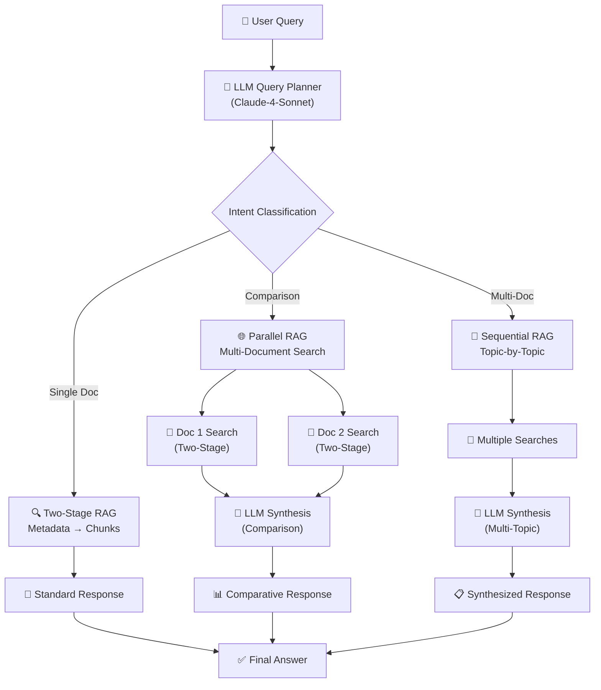

# 🧠 Intelligent Multi-Stage RAG Chatbot with Snowflake Cortex

An advanced **Agentic RAG** implementation using Snowflake Cortex Search that intelligently handles single-document queries, document comparisons, and multi-document analysis through LLM-powered query planning.


## 🎯 **What Makes This Special**

This isn't your typical RAG chatbot. It features:

- **🧠 Intelligent Query Planning**: LLM analyzes user intent and routes to optimal search strategy
- **🔄 Multi-Stage Retrieval**: Two-stage search (metadata → chunks) for precision
- **🌐 Parallel Document Search**: Concurrent searches for comparison queries
- **🎯 Intent-Aware Routing**: Different workflows for single-doc, comparison, and multi-doc queries
- **🤖 LLM Synthesis**: Advanced comparison and multi-document analysis
- **🛡️ Robust Fallbacks**: Multiple fallback mechanisms ensure reliability

## 🏗️ **Architecture Overview**



## 🚀 **RAG Classification**

This implementation represents **Advanced Agentic RAG** with multiple sophisticated patterns:

- **Agentic RAG**: LLM-powered query planning and routing
- **Multi-Stage RAG**: Metadata → Chunk retrieval pipeline
- **Parallel RAG**: Concurrent document searches for comparisons
- **Intent-Aware RAG**: Query classification and adaptive strategies
- **Hybrid RAG**: Multiple Cortex Search services with different purposes

## 🎯 **Perfect For**

- 📋 **Legal Document Comparison** - Compare contracts, agreements, policies
- 📊 **Contract Analysis** - Analyze terms, conditions, and clauses
- 🏢 **Enterprise Knowledge Management** - Navigate large document repositories
- 🔍 **Multi-Document Research** - Synthesize information across documents

## 📖 **Example Queries**

### Single Document Queries
```
"What are the termination clauses in the NETGEAR distributor agreement?"
"What is the governing law for the development agreement?"
"What are the liability limitations in the hosting agreement?"
```

### Comparison Queries ⭐
```
"Compare the termination provisions between the agency agreement and distributor agreement"
"What are the differences in IP ownership between the development and endorsement agreements?"
"How do the liability caps vary across the hosting and distribution agreements?"
```

### Multi-Document Queries
```
"What are the common governing law provisions across all agreements?"
"Which contracts have the most restrictive non-compete clauses?"
"How do renewal terms vary across different contract types?"
```

## 📊 **Sample Dataset: CUAD v1**

This repository includes sample legal contracts from the [**Contract Understanding Atticus Dataset (CUAD) v1**](https://www.atticusprojectai.org/cuad):

- **📄 Real Commercial Contracts**: Agency, Development, Distribution, Endorsement, and Hosting agreements
- **⚖️ Expert Annotations**: 13,000+ labels across 41 legal clause categories
- **🎯 Perfect for Testing**: Demonstrates advanced comparison and analysis capabilities
- **📚 Educational Value**: Learn from real-world legal document complexity

**See detailed information**: [CUAD Sample Data Documentation](docs/CUAD_SAMPLE_DATA.md)

## 🛠️ **Quick Start**

### Prerequisites
- Snowflake account with Cortex enabled
- Python 3.11+
- Documents uploaded to Snowflake stage

### 1. Clone and Setup
```bash
git clone https://github.com/sfc-gh-ddejesus/snowflake-intelligent-rag-chatbot.git
cd snowflake-intelligent-rag-chatbot
pip install -r requirements.txt
```

### 2. Configure Snowflake
Follow the detailed setup instructions in [SETUP.md](SETUP.md) to:
- Create document tables
- Set up Cortex Search services
- Configure authentication

### 3. Run the Application
```bash
# Interactive RAG Chatbot
streamlit run rag_demo.py
```

## 📊 **AI Observability & Evaluation Framework**

This repository includes a comprehensive evaluation framework using **TruLens** and **Snowflake AI Observability** through a dedicated notebook approach:

### **🔍 Key Features**
- **Batch Evaluation**: Systematic testing with RAG triad metrics
- **Professional Metrics**: Context Relevance, Groundedness, Answer Relevance  
- **Notebook-Based**: Proper TruLens execution environment
- **Performance Optimization**: Automatic warehouse scaling
- **Comprehensive Traces**: Detailed execution analysis

### **🎯 Evaluation Setup**
```bash
# 1. Install TruLens packages (included in requirements.txt)
pip install trulens-core==1.5.2 trulens-providers-cortex==1.5.2

# 2. Open batch_evaluation.ipynb in Snowflake Notebooks
# 3. Execute all cells for comprehensive evaluation
```

### **📈 View Results**
Navigate to **Snowsight → AI & ML → Evaluations** to view:
- Detailed trace analysis from notebook execution
- RAG triad metrics dashboard  
- Individual query performance analysis
- Comparative evaluation results

**📚 Complete Documentation**: [Evaluation Framework Guide](docs/EVALUATION_FRAMEWORK.md)

## 📁 **Repository Structure**

```
snowflake-intelligent-rag-chatbot/
├── README.md                      # This file
├── SETUP.md                      # Detailed setup instructions
├── ARCHITECTURE.md               # Technical architecture details
├── requirements.txt              # Python dependencies (includes TruLens)
├── rag_demo.py                   # Main Streamlit application
├── setup_notebook.ipynb          # Snowflake setup notebook
├── batch_evaluation.ipynb        # TruLens batch evaluation notebook
├── evaluation_setup.ipynb        # TruLens observability setup
├── CUAD_v1/                      # Sample legal contracts dataset
│   ├── CUAD_v1_README.txt        # Official CUAD documentation
│   └── full_contract_pdf/        # Sample PDF contracts
│       ├── Part_I/               # Agency, Development agreements
│       ├── Part_II/              # Distribution, Hosting agreements  
│       └── Part_III/             # Additional contract samples
├── docs/                         # Additional documentation
│   ├── CUAD_SAMPLE_DATA.md       # CUAD dataset documentation
│   ├── EVALUATION_FRAMEWORK.md   # AI observability guide
│   └── examples/                 # Usage examples
└── .gitignore                    # Git ignore rules
```

## 🔧 **Key Features**

### **Intelligent Query Analysis**
- Automatically detects comparison vs. single-document queries
- Extracts document names and creates optimized search strategies
- Handles complex multi-document questions

### **Two-Stage Search Pipeline**
1. **Metadata Search**: `CS_DOCUMENTS_METADATA` - Find relevant documents
2. **Chunk Search**: `CS_DOCUMENTS_CHUNKS` - Get specific content with filtering

### **Advanced Comparison Logic**
- Parallel searches for each document in comparison
- Document name prioritization in filename matching
- LLM-powered synthesis for structured comparisons

### **Robust Error Handling**
- Multiple fallback mechanisms
- Graceful degradation when searches fail
- Comprehensive debug information

## 🐛 **Debug Features**

Enable debug mode in the sidebar to see:
- Query analysis and intent detection
- Document search results and prioritization
- Fallback triggers and reasons
- Synthesis context and processing steps

## 🤝 **Contributing**

1. Fork the repository
2. Create a feature branch (`git checkout -b feature/amazing-feature`)
3. Commit your changes (`git commit -m 'Add amazing feature'`)
4. Push to the branch (`git push origin feature/amazing-feature`)
5. Open a Pull Request

## 📄 **License**

This project is licensed under the Apache License 2.0 - see the [LICENSE](LICENSE) file for details.

## 🙏 **Acknowledgments**

- **Snowflake Cortex** for powerful search and LLM capabilities
- **Streamlit** for the excellent web app framework
- **Claude-4-Sonnet** for intelligent query planning and synthesis

## 📞 **Support**

- 📧 **Issues**: [GitHub Issues](https://github.com/sfc-gh-ddejesus/snowflake-intelligent-rag-chatbot/issues)
- 📖 **Documentation**: [Setup Guide](SETUP.md) | [Architecture](ARCHITECTURE.md)
- 💬 **Discussions**: [GitHub Discussions](https://github.com/sfc-gh-ddejesus/snowflake-intelligent-rag-chatbot/discussions)

---

⭐ **Star this repo if you found it helpful!** ⭐
