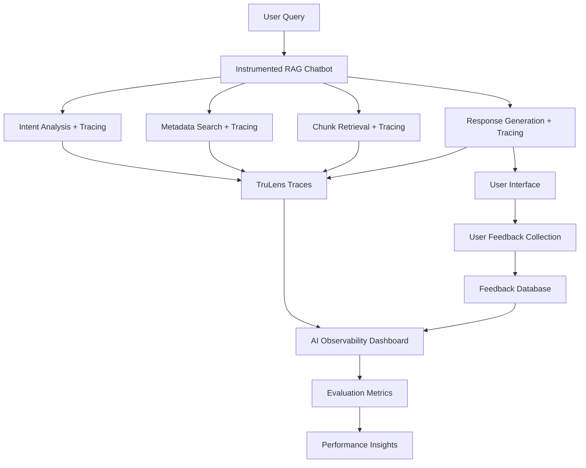

# 📊 AI Observability & Evaluation Framework

This document provides a comprehensive guide to the evaluation framework implemented for the Intelligent Multi-Stage RAG Chatbot using **TruLens** and **Snowflake AI Observability**.

## 🎯 **Overview**

The evaluation framework provides state-of-the-art observability and evaluation capabilities for your RAG chatbot, enabling you to:

- **Track Performance**: Monitor retrieval quality, response accuracy, and user satisfaction
- **Collect Feedback**: Gather real user ratings and comments for continuous improvement
- **Measure Metrics**: Compute the RAG Triad (Context Relevance, Groundedness, Answer Relevance)
- **Debug Issues**: Trace each component of the RAG pipeline for detailed diagnostics
- **Compare Versions**: A/B test different configurations and model versions

## 🏗️ **Architecture**

### **Evaluation Components**



### **TruLens Integration**

The framework uses **TruLens 1.5.2** with Snowflake connectors to provide:

1. **Comprehensive Tracing**: Every component is instrumented with OpenTelemetry spans
2. **Automatic Evaluation**: LLM-as-a-judge evaluation metrics
3. **Visual Dashboards**: Snowsight-based evaluation interface
4. **Batch Processing**: Large-scale evaluation runs on test datasets

## 📊 **Evaluation Metrics**

### **RAG Triad Metrics**

The framework implements the industry-standard **RAG Triad** for comprehensive evaluation:

#### **1. Context Relevance**
- **Purpose**: Measures if retrieved contexts are relevant to the user query
- **Method**: LLM judge evaluates query-context relevance
- **Scale**: 0.0 (irrelevant) to 1.0 (highly relevant)
- **Critical For**: Diagnosing retrieval quality issues

#### **2. Groundedness**
- **Purpose**: Measures if the response is supported by the retrieved context
- **Method**: LLM judge with Chain-of-Thought reasoning
- **Scale**: 0.0 (not grounded) to 1.0 (fully grounded)
- **Critical For**: Detecting hallucinations and ensuring factual accuracy

#### **3. Answer Relevance**
- **Purpose**: Measures if the response addresses the user's question
- **Method**: LLM judge evaluates query-response relevance
- **Scale**: 0.0 (irrelevant) to 1.0 (highly relevant)
- **Critical For**: Ensuring responses are on-topic and helpful

### **User Satisfaction Metrics**

#### **User Ratings (1-5 Scale)**
- **⭐ 1 Star**: Poor - Unhelpful or incorrect response
- **⭐⭐ 2 Stars**: Below Average - Partially helpful but significant issues
- **⭐⭐⭐ 3 Stars**: Average - Adequate response with room for improvement
- **⭐⭐⭐⭐ 4 Stars**: Good - Helpful and mostly accurate response
- **⭐⭐⭐⭐⭐ 5 Stars**: Excellent - Comprehensive, accurate, and highly useful

#### **Qualitative Feedback**
- **Comments**: Free-text feedback for improvement suggestions
- **Categories**: Automatically classified (accuracy, completeness, clarity, etc.)

## 🛠️ **Setup Instructions**

### **1. Prerequisites**

Ensure you have the required privileges in Snowflake:

```sql
-- Required roles and privileges
GRANT ROLE SNOWFLAKE.CORTEX_USER TO USER your_user;
GRANT APPLICATION ROLE SNOWFLAKE.AI_OBSERVABILITY_EVENTS_LOOKUP TO USER your_user;
GRANT CREATE EXTERNAL AGENT ON SCHEMA your_schema TO USER your_user;
```

### **2. Install Dependencies**

```bash
pip install -r requirements.txt
```

Required packages include:
- `trulens-core==1.5.2`
- `trulens-providers-cortex==1.5.2`
- `trulens-connectors-snowflake==1.5.2`

### **3. Set Up Observability Database**

Run the setup notebook to create the necessary database objects:

```python
# Execute in Snowflake notebook or Python environment
exec(open('evaluation_setup.ipynb').read())
```

This creates:
- `AI_OBSERVABILITY_DB.EVALUATION_SCHEMA` for traces and metrics
- `USER_FEEDBACK` table for collecting user ratings and comments
- `CUAD_EVALUATION_DATASET` test dataset for systematic evaluation

### **4. Launch Enhanced Chatbot**

```bash
streamlit run rag_demo_with_evaluation.py
```

## 📈 **Using the Evaluation Framework**

### **Real-Time Monitoring**

1. **Start the Application**: Launch the Streamlit app with evaluation enabled
2. **Interact Normally**: Ask questions and receive responses as usual
3. **Provide Feedback**: Rate responses using the 1-5 star system
4. **View Traces**: Check Snowsight → AI & ML → Evaluations for detailed traces

### **Batch Evaluation**

For systematic evaluation on test datasets:

```python
from trulens.core.run import Run, RunConfig

# Configure evaluation run
run_config = RunConfig(
    run_name="cuad_legal_contracts_evaluation",
    dataset_name="CUAD_EVALUATION_DATASET",
    description="Legal contracts analysis evaluation",
    label="cuad_rag_eval",
    source_type="TABLE",
    dataset_spec={
        "input": "QUERY",
        "ground_truth_output": "GROUND_TRUTH",
    },
)

# Execute evaluation
evaluation_run = tru_rag_app.add_run(run_config=run_config)
evaluation_run.start()

# Compute metrics
evaluation_run.compute_metrics([
    "context_relevance",
    "groundedness", 
    "answer_relevance"
])
```

## 🎛️ **Dashboard & Monitoring**

### **Snowsight AI Observability Interface**

Navigate to **Snowsight → AI & ML → Evaluations** to access:

1. **Applications Overview**: View all registered RAG applications
2. **Runs Comparison**: Compare performance across different evaluation runs
3. **Detailed Traces**: Inspect individual query traces with span-level details
4. **Metrics Visualization**: View aggregated metrics and trends over time

### **Streamlit Sidebar Metrics**

The enhanced chatbot includes real-time metrics in the sidebar:

- **Average User Rating**: Live calculation of user satisfaction
- **Total Feedback**: Number of feedback submissions
- **Rating Distribution**: Bar chart showing rating frequency
- **TruLens Status**: Confirmation of active tracing

## 🔧 **Advanced Configuration**

### **Custom Evaluation Metrics**

Extend the framework with custom metrics:

```python
from trulens.core.feedback import Feedback

# Define custom metric
def custom_legal_accuracy(question, response, context):
    prompt = f"""
    Evaluate the legal accuracy of this response:
    Question: {question}
    Response: {response}
    Context: {context}
    
    Rate from 0.0 to 1.0 based on legal accuracy.
    """
    return llm_judge(prompt)

# Register with TruLens
custom_feedback = Feedback(custom_legal_accuracy)
evaluation_run.compute_metrics(["custom_legal_accuracy"])
```

### **A/B Testing Framework**

Compare different RAG configurations:

```python
# Version A: Standard retrieval
app_v1 = TruApp(
    standard_rag,
    app_name="rag_chatbot",
    app_version="standard_v1"
)

# Version B: Enhanced multi-stage retrieval  
app_v2 = TruApp(
    enhanced_rag,
    app_name="rag_chatbot", 
    app_version="enhanced_v2"
)

# Compare performance
compare_results = compare_apps([app_v1, app_v2])
```

## 📊 **Test Datasets**

### **CUAD Legal Contracts Dataset**

The framework includes a curated test set based on the CUAD dataset:

- **5 representative queries** covering different complexity levels
- **Ground truth answers** for accuracy measurement
- **Query categories**: Single document, comparison, multi-document
- **Complexity levels**: Medium to high complexity legal questions

### **Sample Test Queries**

1. **Single Document (Medium)**:
   - Query: "What are the termination clauses in the NETGEAR distributor agreement?"
   - Tests: Basic document retrieval and clause extraction

2. **Comparison (High)**:
   - Query: "Compare IP ownership provisions between development and endorsement agreements"
   - Tests: Multi-document analysis and synthesis capabilities

3. **Multi-Document (High)**:
   - Query: "What governing law provisions are common across distribution agreements?"
   - Tests: Cross-document pattern recognition

## 🎯 **Best Practices**

### **For Developers**

1. **Instrument Early**: Add TruLens instrumentation from the start of development
2. **Test Continuously**: Run evaluations with every significant change
3. **Monitor Trends**: Track metrics over time to identify degradation
4. **User-Centric**: Prioritize user feedback in your evaluation strategy

### **For Legal Domain Applications**

1. **Domain Expertise**: Include legal experts in evaluation design
2. **Accuracy Focus**: Prioritize groundedness and factual accuracy
3. **Comparison Testing**: Emphasize multi-document comparison capabilities
4. **Citation Quality**: Ensure proper source attribution in responses

## 🚀 **Performance Optimization**

### **Retrieval Optimization**

Monitor retrieval metrics to optimize:

- **Context Relevance < 0.7**: Improve search queries or embedding models
- **Low Recall**: Increase chunk overlap or search result limits
- **High Latency**: Optimize search service configuration

### **Generation Optimization**

Monitor generation metrics to optimize:

- **Groundedness < 0.8**: Improve prompt engineering or context filtering
- **Answer Relevance < 0.7**: Refine instruction prompts
- **User Ratings < 4.0**: Analyze feedback comments for improvement areas

## 🎓 **Educational Resources**

### **Key Concepts**

- **LLM-as-a-Judge**: Using LLMs to evaluate other LLMs objectively
- **OpenTelemetry**: Distributed tracing standard for observability
- **RAG Triad**: Industry-standard evaluation framework for RAG systems
- **Span Attributes**: Metadata attached to traces for detailed analysis

### **Related Documentation**

- [TruLens Documentation](https://trulens.org/docs/)
- [Snowflake AI Observability Guide](https://docs.snowflake.com/en/user-guide/ai-observability)
- [OpenTelemetry Specification](https://opentelemetry.io/docs/specs/otel/)

## 🔍 **Troubleshooting**

### **Common Issues**

1. **TruLens Import Errors**:
   ```bash
   pip install trulens-core==1.5.2 trulens-providers-cortex==1.5.2 trulens-connectors-snowflake==1.5.2
   ```

2. **Permission Errors**:
   ```sql
   GRANT APPLICATION ROLE SNOWFLAKE.AI_OBSERVABILITY_EVENTS_LOOKUP TO USER your_user;
   ```

3. **No Traces Appearing**:
   - Verify `TRULENS_OTEL_TRACING=1` environment variable
   - Check Snowflake session permissions
   - Confirm database and schema creation

4. **Evaluation Metrics Not Computing**:
   - Ensure test dataset has correct column names
   - Verify LLM model access permissions
   - Check evaluation run status in Snowsight

This comprehensive evaluation framework provides the foundation for building, monitoring, and continuously improving your intelligent RAG chatbot with state-of-the-art observability and user feedback integration! 🚀
